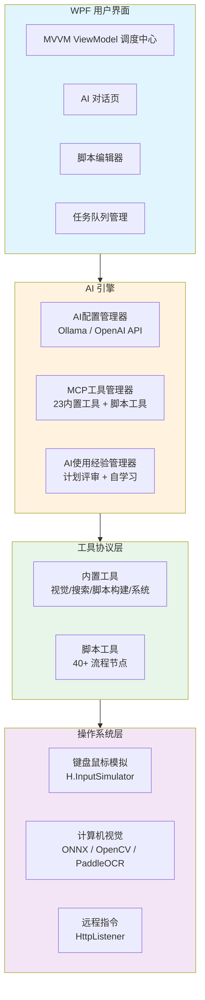
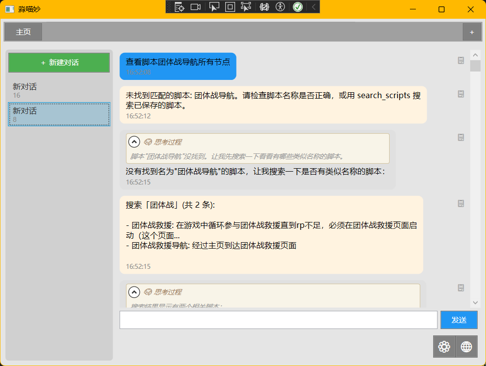
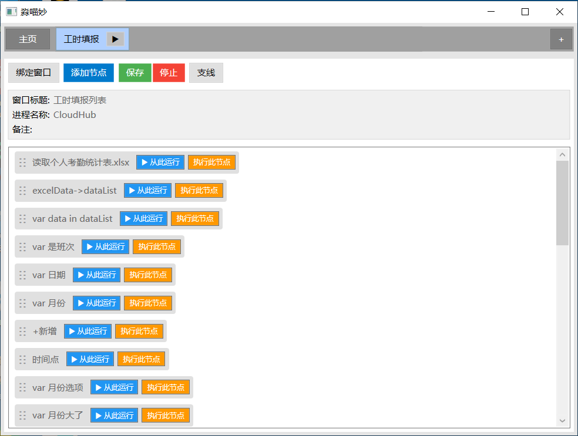
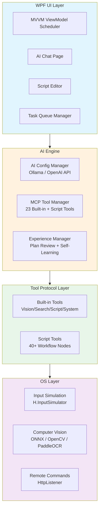

# 淼喵妙脚本DIY — 多模态 AI Agent 桌面工具

[](https://github.com/baiyaoseshi/mmmdiy/actions/workflows/dotnet.yml)

> 🚀 将本地 LLM + 视觉 AI + RPA 自动化融为一体的 Windows 桌面工具。AI 可直接调用 23 个内置工具和 40+ 种流程节点，实现从对话到脚本构建到自动执行的完整闭环。

**Technologies**: C# · WPF · .NET 10 · MVVM · Ollama / OpenAI API · MCP Protocol · ONNX Runtime (YOLO) · OpenCV · PaddleOCR · xUnit

---

## ✨ 核心能力

| 模块 | 说明 |
|------|------|
| **🤖 AI Agent 引擎** | 支持 Ollama 本地模型 + OpenAI 兼容 API，流式对话、工具调用、思考内容分离、计划评审、经验自学习 |
| **🔧 MCP 工具协议** | 自研 23 个内置工具（视觉分析、网页搜索、脚本构建链、系统控制），AI 自动选择合适的工具完成复杂任务 |
| **👁️ 计算机视觉** | YOLO 目标检测、PaddleOCR 文字识别、OpenCV 图像处理、自定义鲁棒模板匹配算法 |
| **⚡ RPA 自动化** | 40+ 种流程节点，支持键盘鼠标模拟、窗口控制、条件判断、定时/触发任务、远程 HTTP 指令 |
| **📡 远程控制** | 内置 HTTP 服务器，支持 `/2AI` 对话、`/task` 任务触发、`/plan` 指令注入 |

## 🏗️ 架构



## 🚀 本地运行

### 前置条件

- [.NET 10 SDK](https://dotnet.microsoft.com/download/dotnet/10.0)
- Windows 10/11 x64
- （可选）[Ollama](https://ollama.com/) + 已拉取的模型（如 `qwen3:latest`），用于本地 LLM
- （可选）OpenAI 兼容 API Key，用于远程 LLM

### 编译运行

```bash
git clone https://github.com/baiyaoseshi/mmmdiy.git
cd mmmdiy
dotnet restore "淼喵妙DIY应用程序\淼喵妙DIY应用程序.slnx"
dotnet build "淼喵妙DIY应用程序\淼喵妙DIY应用程序.slnx" --configuration Release

# 运行
dotnet run --project "淼喵妙DIY应用程序\淼喵妙用户界面\淼喵妙用户界面.csproj"
```

### 运行测试

```bash
dotnet test "淼喵妙DIY应用程序\淼喵妙DIY应用程序.slnx"
```

## 📂 项目结构

```
├── 淼喵妙DIY应用程序/
│   ├── 淼喵妙用户界面/        # WPF UI 层 (MVVM, 8 ViewModels, 16 XAML)
│   │   ├── ViewModels/        # MainWindowViewModel (调度中心)
│   │   ├── Controls/          # AIChatPage, AIChatControl, ScriptEditor
│   │   └── Dialogs/           # 节点编辑/选择对话框
│   └── 淼喵妙神奇工具库/      # 核心引擎 (76 files, ~14k lines)
│       ├── AI配置管理器.cs     # LLM 调用核心中枢
│       ├── AI使用经验管理器.cs  # 经验学习 + 计划评审
│       ├── MCP工具管理器.cs    # 工具注册与分派
│       ├── 通用MCP工具.cs      # 23 个内置工具实现
│       ├── 感知库/             # CV: 图像识别、OCR、串联
│       ├── 键鼠库/动作/        # RPA 引擎 + 40+ 流程节点
│       └── 输出库/             # 通知 + 图像工具
└── 淼喵妙测试项目/             # xUnit 单元测试
    └── CoreTests.cs
```

## 📸 截图

> 将截图放入 `docs/screenshots/` 目录，然后替换下方占位链接。




---

# MiaoMiaoMiao Script DIY — Multimodal AI Agent Desktop Tool

[](https://github.com/baiyaoseshi/mmmdiy/actions/workflows/dotnet.yml)

> A Windows desktop tool that integrates local LLMs, vision AI, and RPA automation into a unified experience. The AI agent can directly invoke 23 built-in tools and 40+ workflow nodes, enabling a complete loop from conversation to script creation to automated execution.

**Technologies**: C# · WPF · .NET 10 · MVVM · Ollama / OpenAI API · MCP Protocol · ONNX Runtime (YOLO) · OpenCV · PaddleOCR · xUnit

## ✨ Core Capabilities

| Module | Description |
|--------|-------------|
| **🤖 AI Agent Engine** | Supports Ollama local models + OpenAI-compatible API with streaming chat, tool calling, thinking/reasoning separation, plan review, and experience self-learning |
| **🔧 MCP Tool Protocol** | Custom implementation of 23 built-in tools (vision analysis, web search, script building pipeline, system control). AI autonomously selects appropriate tools for complex tasks |
| **👁️ Computer Vision** | YOLO object detection (ONNX), PaddleOCR text recognition, OpenCV image processing, custom robust template matching algorithm |
| **⚡ RPA Automation** | 40+ workflow node types supporting keyboard/mouse simulation, window control, conditional branching, scheduled/triggered tasks, remote HTTP commands |
| **📡 Remote Control** | Built-in HTTP server supporting `/2AI` chat commands, `/task` trigger events, and `/plan` injection |

## 🏗️ Architecture



## 🚀 Getting Started

### Prerequisites

- [.NET 10 SDK](https://dotnet.microsoft.com/download/dotnet/10.0)
- Windows 10/11 x64
- (Optional) [Ollama](https://ollama.com/) with a pulled model (e.g., `qwen3:latest`) for local LLM
- (Optional) OpenAI-compatible API Key for remote LLM

### Build & Run

```bash
git clone https://github.com/baiyaoseshi/mmmdiy.git
cd mmmdiy
dotnet restore "淼喵妙DIY应用程序\淼喵妙DIY应用程序.slnx"
dotnet build "淼喵妙DIY应用程序\淼喵妙DIY应用程序.slnx" --configuration Release

# Run
dotnet run --project "淼喵妙DIY应用程序\淼喵妙用户界面\淼喵妙用户界面.csproj"
```

### Run Tests

```bash
dotnet test "淼喵妙DIY应用程序\淼喵妙DIY应用程序.slnx"
```

## 📂 Project Structure

```
├── 淼喵妙DIY应用程序/
│   ├── 淼喵妙用户界面/        # WPF UI Layer (MVVM, 8 ViewModels, 16 XAML)
│   │   ├── ViewModels/        # MainWindowViewModel (scheduler hub)
│   │   ├── Controls/          # AIChatPage, AIChatControl, ScriptEditor
│   │   └── Dialogs/           # Node editing/selection dialogs
│   └── 淼喵妙神奇工具库/      # Core Engine (76 files, ~14k lines)
│       ├── AI配置管理器.cs     # LLM invocation hub
│       ├── AI使用经验管理器.cs  # Experience learning + plan review
│       ├── MCP工具管理器.cs    # Tool registration & dispatch
│       ├── 通用MCP工具.cs      # 23 built-in tool implementations
│       ├── 感知库/             # CV: image recognition, OCR, pipelines
│       ├── 键鼠库/动作/        # RPA engine + 40+ workflow nodes
│       └── 输出库/             # Notifications + image utilities
└── 淼喵妙测试项目/             # xUnit unit tests
    └── CoreTests.cs
```

## 📸 Screenshots

> Place screenshots in `docs/screenshots/` and update the placeholder links below.


